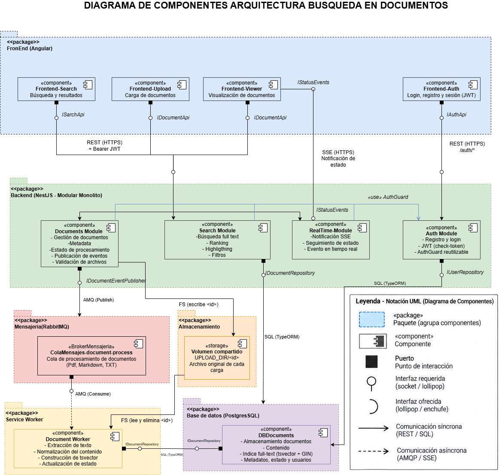

# Arquitectura

## 1. Objetivo

La solución tiene como objetivo permitir la carga, procesamiento,
búsqueda y visualización de documentos técnicos dentro de una
aplicación web.

## 2. Estilo arquitectónico

La solución utiliza un **Modular Monolito** para el backend,
implementado con NestJS.

Internamente, los módulos siguen los principios de **Onion
Architecture**, separando dominio, aplicación, infraestructura
y presentación.

## 3. Diagrama de componentes

## 4. Componentes principales

### Frontend

Aplicación Angular responsable de:

- Búsqueda de documentos: pantalla `/search` (ruta privada, carga perezosa) con barra de búsqueda, resultados con el término resaltado y la relevancia, orden y paginación de 10 en 10. El estado (`q`, `sort`, `page`) vive en la URL. Consume `GET /search`, que aún no existe en el backend (SPEC-10 §6 define el contrato esperado); mientras tanto usa un mock local seleccionado con `useMockSearch` (`false` en producción). El resaltado llega como segmentos `{ text, highlight }` y se renderiza sin `innerHTML`.
- Carga de documentos: pantalla `/documents/upload` (ruta privada, carga perezosa) que valida tipo y tamaño en el cliente, envía el archivo y la metadata por `POST /documents` con progreso de subida y muestra el identificador y el estado `PROCESANDO` devueltos por el API. El backend sigue siendo la autoridad de validación.
- Visualización de documentos: pantalla `/documents/:id` (ruta privada, carga perezosa) que consulta `GET /documents/:id` y muestra el estado, los metadatos y el texto extraído. El contenido se presenta como texto plano, sin `innerHTML` (el texto viene de archivos subidos por usuarios), y resalta los términos de `?q=` con coincidencia literal en el cliente. Cubre `PROCESADO`, `PROCESANDO` (actualización manual: aún no hay SSE), `ERROR` (mensaje genérico), no encontrado y error de red. «Volver a resultados» usa el historial.
- Recepción de eventos de procesamiento (pendiente: el seguimiento en vivo por SSE aún no está implementado en el frontend).

### Backend

Aplicación NestJS organizada como Modular Monolito.

#### Auth Module

Responsable de:

- Registro e inicio de sesión de usuarios.
- Emisión y renovación de tokens JWT (`check-token`).
- `AuthGuard` reutilizable por los demás módulos para exigir un usuario autenticado.
- Persistencia de usuarios (`users`) con contraseña hasheada (bcrypt).

#### Documents Module

Responsable de:

- Gestión de documentos.
- Metadatos.
- Estado del procesamiento.
- Publicación de eventos de procesamiento.
- Validación del archivo recibido (solo TXT, PDF y Markdown; tamaño máximo configurable
  con `UPLOAD_MAX_FILE_SIZE_BYTES`; contenido coherente con el formato) antes de
  registrar el documento o publicar el evento.

**Modelo `Document`** (tabla `documents` en PostgreSQL):

| Campo | Descripción |
|---|---|
| `id` | Identificador único (uuid generado por la base de datos). |
| `title`, `author`, `category`, `version` | Metadatos del documento (texto libre). |
| `tags` | Lista de etiquetas. |
| `file_name`, `file_format` | Nombre y formato del archivo (`TXT`, `PDF`, `MD`). |
| `status` | Estado de procesamiento: `PROCESANDO` → `PROCESADO` o `ERROR`. |
| `content` | Texto extraído; es nulo hasta que el Document Worker lo procesa. |
| `owner_id` | Usuario que subió el documento (FK a `users`). |
| `created_at`, `updated_at` | Fechas de creación y actualización. |

Un documento nace en `PROCESANDO`. Solo puede pasar a `PROCESADO` o `ERROR`, y esos
estados son finales.

**Consulta de un documento.** `GET /documents/:id` (capas application y presentation de
Documents) lee por clave primaria el documento con su estado y contenido. Es de solo
lectura: no toca el `FileStore` ni RabbitMQ y no devuelve el archivo original ni `owner_id`.
Errores: `400` (id que no es UUID), `401` y `404`.

#### Search Module

Responsable de:

- Búsqueda Full-Text.
- Ranking de resultados.
- Highlighting.
- Filtros.

#### Realtime Module

Responsable de:

- Comunicación mediante SSE.
- Notificación de cambios de estado.
- Eventos en tiempo real.

### RabbitMQ

Broker utilizado para desacoplar la recepción de documentos
del procesamiento en segundo plano.

### Document Worker

Proceso encargado de:

- Extracción de texto.
- Normalización del contenido.
- Construcción del índice `tsvector`.
- Actualización del estado del documento.

Consume `documents.process` con `ack` manual y `prefetch(1)`. Solo confirma el mensaje después de dejar el resultado en PostgreSQL (`PROCESADO` con `content`, o `ERROR`) mediante un único `UPDATE` condicionado a `status = 'PROCESANDO'`, lo que lo hace idempotente ante entregas repetidas. Los fallos deterministas (archivo ausente, contenido no válido, formato sin extractor) marcan el documento como `ERROR`; los transitorios se reintentan 3 veces y después el mensaje va a la DLQ `documents.process.dlq`, dejando el documento en `PROCESANDO` y su archivo en el volumen. Es un proceso independiente del API (`npm run start:worker`) que no necesita `JWT_SECRET`. La extracción se hace por formato: TXT y MD como texto UTF-8, y PDF con `unpdf` (máximo 500 páginas). Un PDF cifrado, dañado, sin capa de texto o con más de 500 páginas deja el documento en `ERROR`; cualquier otro fallo inesperado se trata como transitorio (reintentos y DLQ).

### PostgreSQL

Responsable de la persistencia de:

- Usuarios.
- Documentos.
- Contenido.
- Metadatos.
- Estado.
- Índice Full-Text Search.

## 5. Comunicación

| Comunicación | Tecnología | Propósito |
|---|---|---|
| Frontend → Backend | REST/HTTPS | Operaciones de documentos y búsqueda |
| Frontend → Backend | REST/HTTPS + Bearer JWT | Autenticación y acceso a endpoints protegidos |
| Backend → Frontend | SSE/HTTPS | Notificaciones de estado |
| Backend → RabbitMQ | AMQP | Publicación de procesamiento |
| Worker → RabbitMQ | AMQP | Consumo de mensajes |
| Backend → PostgreSQL | SQL | Persistencia y búsqueda |
| Worker → PostgreSQL | SQL | Actualización del documento e índice |
| Backend → Worker | Volumen compartido (`UPLOAD_DIR`) | Entrega del archivo original, guardado con el `id` del documento como nombre |

## 6. Procesamiento asíncrono

El procesamiento de documentos se realiza de forma asíncrona
mediante RabbitMQ y un Document Worker.

El API no espera a que finalice el procesamiento para responder
al usuario.

Tras registrar el documento en `PROCESANDO` y guardar su archivo, el
Documents Module publica un mensaje persistente `{ "documentId" }` en la
cola `documents.process` de RabbitMQ y espera la confirmación del broker
(publisher confirms, timeout de 5 s) antes de responder `202`. Si el
broker no lo confirma, el documento y su archivo se eliminan y se
responde `503`. La cola declara un dead-letter (`documents.dlx` →
`documents.process.dlq`). El Document Worker consume con ACK manual,
confirma solo tras dejar el documento en estado final y rechaza con
`nack(requeue=false)` ante un fallo, para que el mensaje vaya a la DLQ.
La entrega es *at-least-once*. Riesgo conocido: una caída del API entre
la persistencia y la confirmación puede dejar un documento en
`PROCESANDO` sin mensaje (sin outbox).

El API guarda el archivo original en un volumen compartido bajo el `id` del documento y
el mensaje de RabbitMQ solo lleva ese `id`; el Worker lo lee y lo elimina al terminar.

## 7. Persistencia y búsqueda

PostgreSQL será utilizado como motor de persistencia y búsqueda
Full-Text Search mediante:

- `tsvector`
- `tsquery`
- índice GIN
- ranking por relevancia
- highlighting
